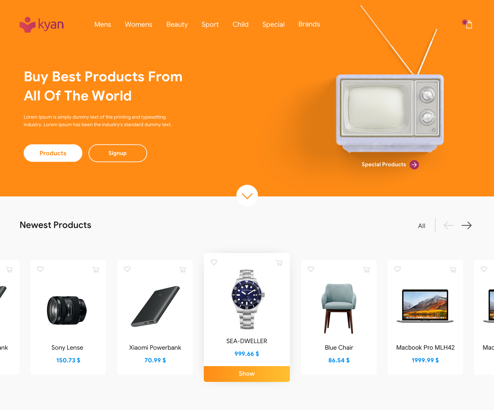

# :convenience_store: E.com


> Sistema de e-commerce desenvolvido para incrementar o portfólio

### Ajustes e melhorias

- [x] Limitar quantidade de tags por produto
- [x] Responsividade dos cards de produtos
- [x] Página do produto
- [x] Sistema de comentário e avaliação do produto
- [ ] Resolver bug da quantidade na tabela da página de finalizar compra
- [ ] Tratar os erros no endpoint de comentários
- [ ] Tratar o loading dos comentários
- [x] Botão para ver avaliações no card do produto 
- [x] Página para finalizar a compra
- [x] Botão para remover produto direto do carrinho
- [ ] Adicionar dinâmica nos cards de produto
- [x] Corrigir bug de remoção e armazenamento do estado do carrinho
- [ ] Limitar tamanho das imagens dos produtos
- [x] Sistema de estoque de produtos

## :large_orange_diamond: Identidade visual


> Design de inspiração para a home do projeto

## :hammer_and_wrench: Tecnologias

- [React](https://pt-br.reactjs.org/)
- [Ant-Design](https://ant.design/)
- [Styled-Components](https://styled-components.com/)

## :computer: Pré-requisitos

Antes de começar, verifique se você atende aos seguintes requisitos:
- Possui instalado a versão mais recente do `yarn` ou `npm`.

## :rocket: Instalando o projeto

Para instalar o projeto, siga estas etapas:

1 - Clone o repositório do projeto.
```sh
git clone https://github.com/EduardoPD1921/e.com-frontend.git
```
2 - Entre na pasta do projeto.
```sh
cd e.com-frontend
```
3 - Instale as dependências.
- npm
```sh
npm install
```
- yarn
```sh
yarn install
```

## :coffee: Rodando o projeto

- npm
```sh
npm start
```

- yarn
```sh
yarn start
```


## :floppy_disk: E.com backend

Para acessar todos os features do projeto é necessário seguir as instruções de instalação do backend, encontradas [nesse repositório](https://github.com/EduardoPD1921/e.com-backend).